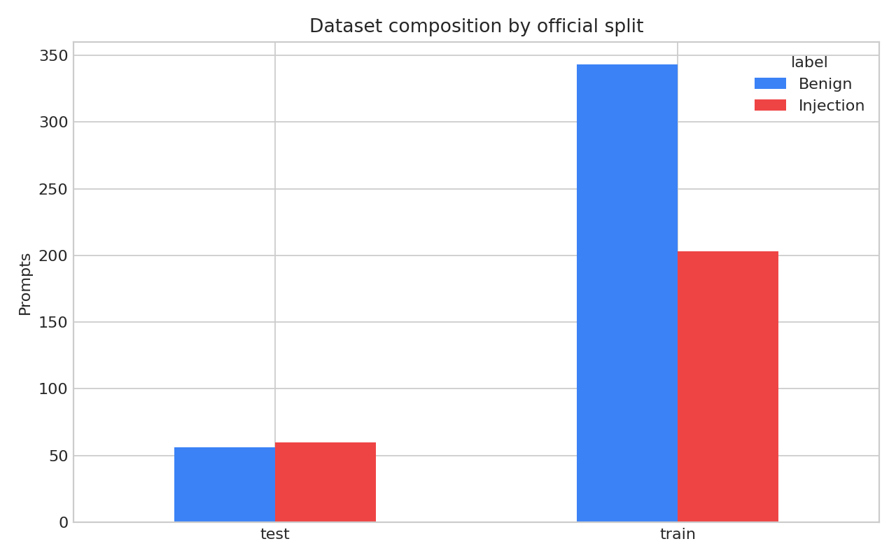
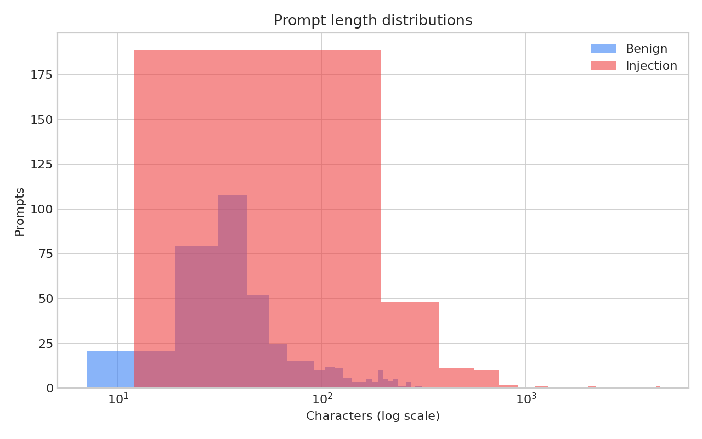
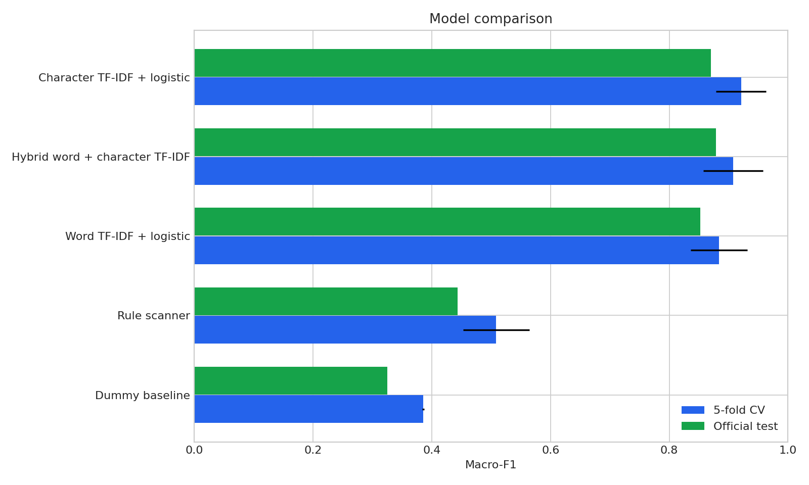
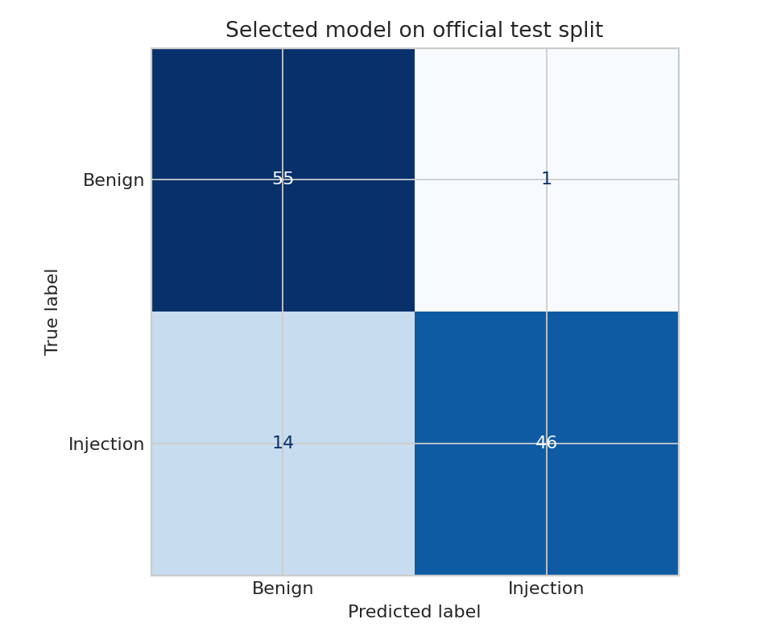
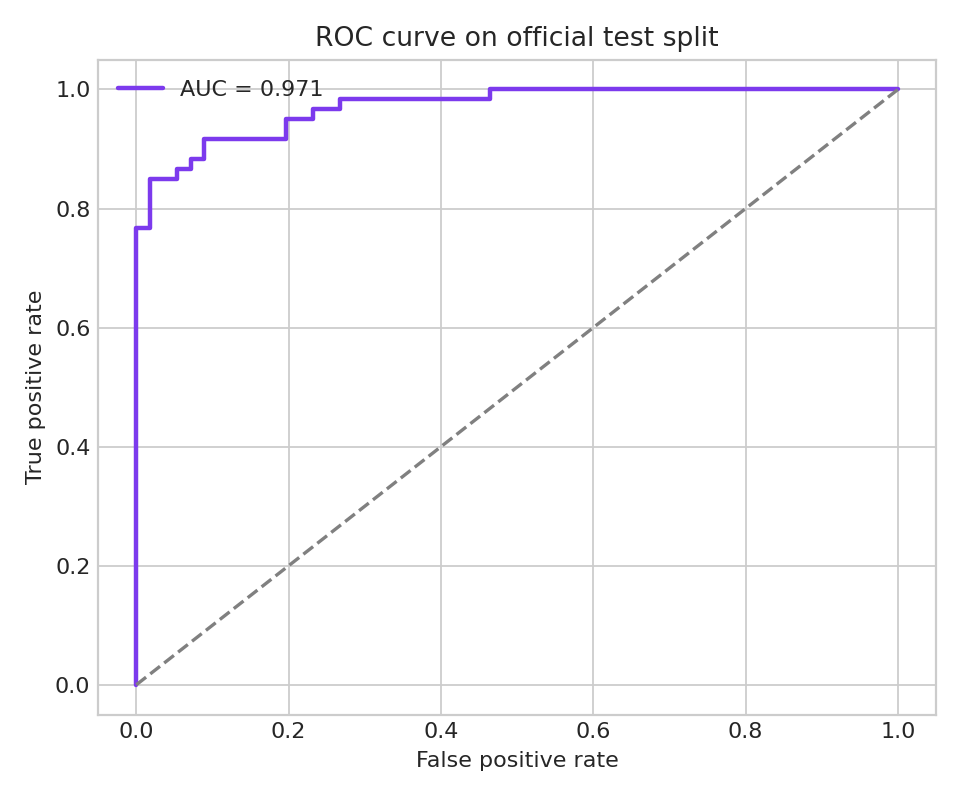
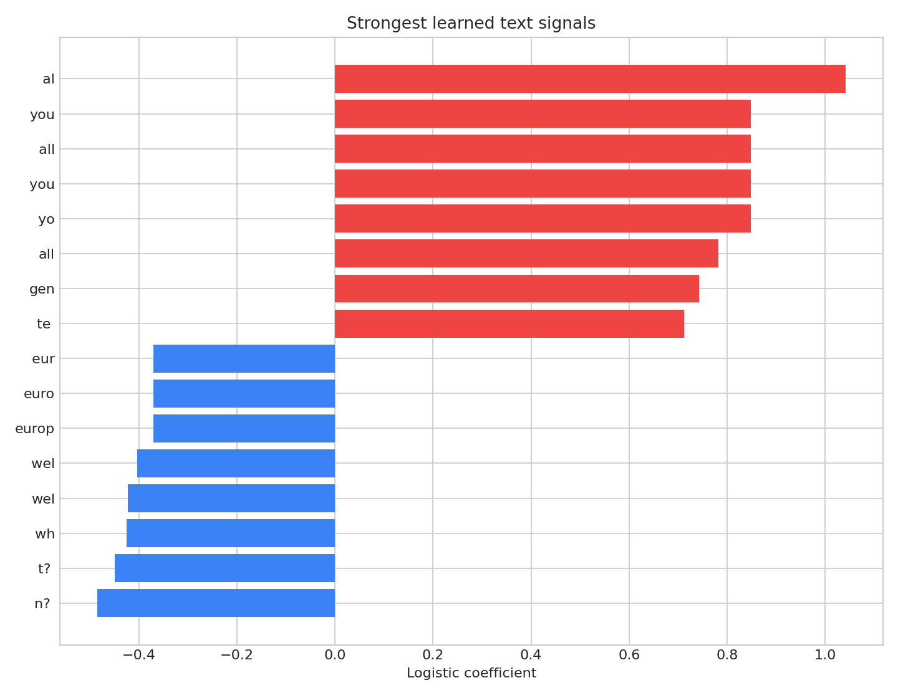

# Prompt Injection Guard for LLM Applications

A local text-classification tool that detects prompt-injection attempts before untrusted text reaches an LLM.

---

## Overview

* **Task:** Binary classification
* **Dataset:** 662 prompts, 1 text feature.
* **Selected Model:** **Character TF-IDF + logistic** (Macro-F1 = 0.8699).
* **Baseline Comparison:** Dummy baseline achieved Macro-F1 = 0.3256.

---

## Key Results

### Training Cross-Validation

| Model | Macro-F1 | Fold SD |
| :--- | :--- | :--- |
| **Character TF-IDF + logistic** | **0.9212** | 0.0422 |
| Hybrid word + character TF-IDF | 0.9074 | 0.0503 |
| Word TF-IDF + logistic | 0.8837 | 0.0477 |
| Rule scanner | 0.5087 | 0.0556 |
| Dummy baseline | 0.3858 | 0.0017 |

### Final Holdout Evaluation (116 Samples)

| Model | Macro-F1 | ROC-AUC | Injection Recall |
| :--- | :--- | :--- | :--- |
| **Character TF-IDF + logistic** | **0.8699** | **0.9708** | **0.7667** |
| Dummy Baseline | 0.3256 | 0.5000 | 0.0000 |

The selected model made **15 errors**: 1 false positives and 14 false negatives. Its fixed-model bootstrap 95% interval for test Macro-F1 is [0.8045, 0.9300].

---

## Data Summary

* **Source:** [deepset Prompt Injections](https://huggingface.co/datasets/deepset/prompt-injections)
* **Data Quality:** 662 usable rows, 1 text feature, 0 missing cells, 0 exact duplicate rows retained because the official split is preserved.
* **Key Feature:**  al had the largest absolute learned coefficient (1.0418).
* **Notes:** The dataset is small and contains recognizable attack phrases. Scores measure this benchmark only; novel, obfuscated, multilingual, or indirect injections may bypass the detector. Use the probability as one layer in a defense-in-depth design.

---

## Visualizations

| Dataset Composition | Prompt Lengths |
| :---: | :---: |
|  |  |

| Model Comparison | Confusion Matrix |
| :---: | :---: |
|  |  |

| ROC Curve | Learned Signals |
| :---: | :---: |
|  |  |

---

## Repository Structure

    figures/                    Data, performance, and diagnostic plots
    analysis.ipynb              Executed analysis summary
    audit.json                  Runtime metadata and source hashes
    data_dictionary.csv         Dataset field definitions
    descriptive_statistics.csv Length statistics by split and class
    error_analysis.csv          Holdout predictions and error types
    feature_importance.csv      Learned text-signal coefficients
    metrics.json                CV and official holdout scores
    prompt_guard.joblib         Fitted local detector
    prompt_guard.py             Reusable command-line scanner
    study.py                    Full study pipeline
    README.md
